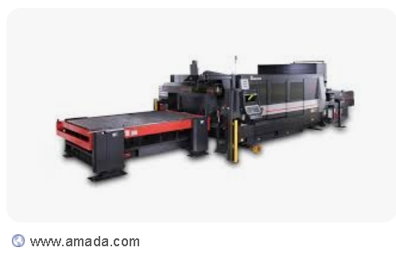
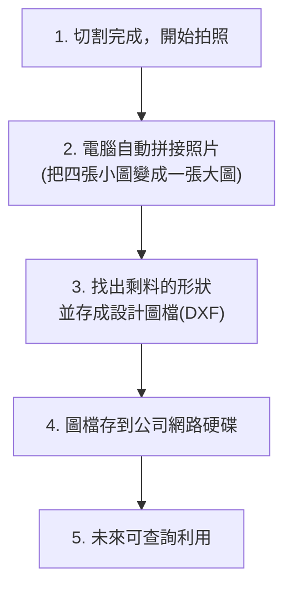

# 聰明餘料回收系統

## 這個專案是做什麼的？

簡單來說，我們的雷射切割機每次切完金屬板後，都會剩下一些不規則的零碎板材 (餘料)。直接丟掉太浪費了。

這套系統的目標，就是**用相機自動拍下這些剩料，算出它們的精確形狀，然後變成電腦圖檔存起來。**

## 為什麼要做這個？

**省錢又環保！**

當這些剩料的圖檔都存進電腦後，未來如果需要切割一些小零件，系統就可以聰明地先從這些剩料庫存中尋找合適的來用，而不是每次都拿一塊全新的大板子。這樣能最大化板材利用率，減少浪費，也降低成本。

## 系統大概長什麼樣子？

## 它是如何運作的？(簡易流程)

## 核心功能說明

1.  **拍照並拼接成大圖**
    *   **怎麼做**: 在切割機的四個角落裝上相機，拍下整個工作區。電腦會自動修正照片變形，然後無縫拼接成一張代表整個工作區的鳥瞰大圖。

2.  **找出形狀並存成圖檔**
    *   **怎麼做**: 電腦分析這張大圖，精準地描出剩下板材的邊緣輪廓，然後把這個輪廓存成一種叫 DXF 的標準設計圖檔。

3.  **儲存與再利用**
    *   **怎麼做**: 這個 DXF 圖檔會被存到公司的網路硬碟。庫存管理系統可以讀取這些檔案，當有新的切割需求時，就能優先利用這些被記錄下來的餘料。

## 相關文件

*   [硬體規格書](./hardware_specifications.md)
*   [專案規格書](./Project_Specification_ZH-TW.md)
