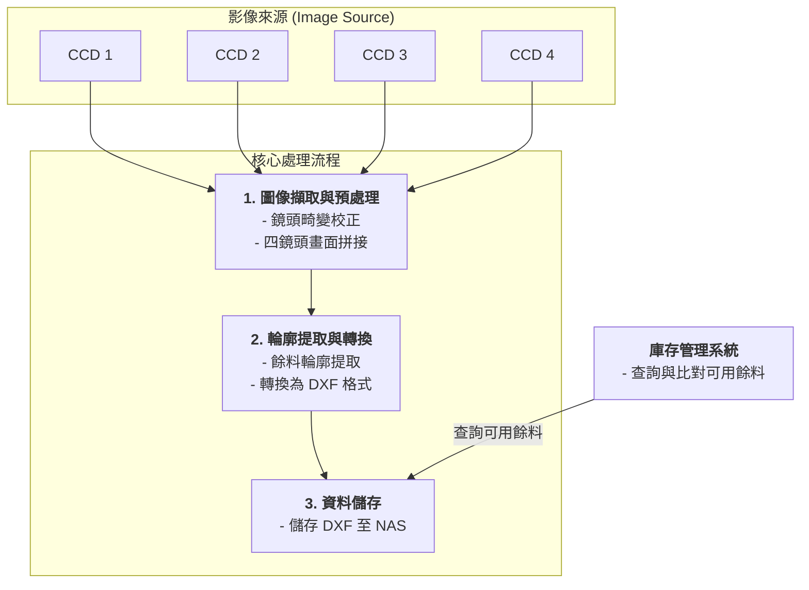

# Visual Waste Management System

## 專案目標

本專案旨在開發一套視覺化板材餘料管理系統。系統安裝於一台 2x4 公尺大小的雷射切割機上，透過四支高解析度 (6464x4852) 的工業CCD相機，自動辨識每次切割後剩餘的板材輪廓，並將其數位化存檔，以供後續的庫存管理與再利用，從而達到節省原料、降低成本的目標。

## 專案文件

詳細的規格文件請參考以下連結：

*   [硬體規格書 (Hardware Specifications)](./hardware_specifications.md)
*   [專案規格書 (Project Specification)](./Project_Specification_ZH-TW.md)

## 系統架構

系統的主要流程是從圖像擷取開始，經過一系列處理，最終生成可供庫存系統利用的 DXF 檔案。

## 核心功能模組

1.  **圖像擷取與預處理 (Image Acquisition & Processing)**
    *   **硬體**: 在工作床台的四個角落安裝四支 6464x4852 解析度的工業CCD相機。
    *   **功能**:
        *   即時擷取四個獨立的畫面。
        *   對每個畫面進行畸變校正(De-warp)，消除鏡頭本身造成的變形。
        *   將校正後的四個畫面無縫拼接成一個代表整個 2x4m 工作區域的完整平面圖。

2.  **輪廓提取與轉換 (Contour Extraction & Conversion)**
    *   **功能**:
        *   對拼接後的完整圖像進行分析，精確提取出雷射切割後剩餘板材的輪廓。
        *   將提取出的輪廓數據轉換為標準的 DXF (Drawing Exchange Format) 向量檔案格式。

3.  **資料儲存 (Data Storage)**
    *   **功能**:
        *   將生成的 DXF 檔案命名並儲存到指定的 NAS (Network Attached Storage) 伺服器上，建立餘料數位資料庫。

## 工作流程

1.  **切割完成後**: 雷射切割機完成一次切割任務。
2.  **啟動拍攝**: 系統觸發四支CCD相機進行拍攝。
3.  **圖像處理**: 系統自動完成畫面的校正與拼接。
4.  **輪廓生成**: 從拼接後的圖像中提取餘料輪廓，並轉換為 DXF 檔案。
5.  **存入資料庫**: DXF 檔案被存入 NAS，並可由庫存管理系統讀取。
6.  **餘料再利用**: 當有新的切割需求時，庫存管理系統可以優先從 NAS 資料庫中比對，尋找尺寸合適的可用餘料進行切割，從而實現廢料的再利用。
